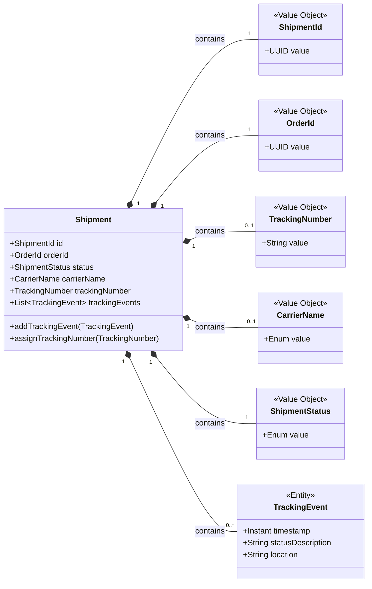
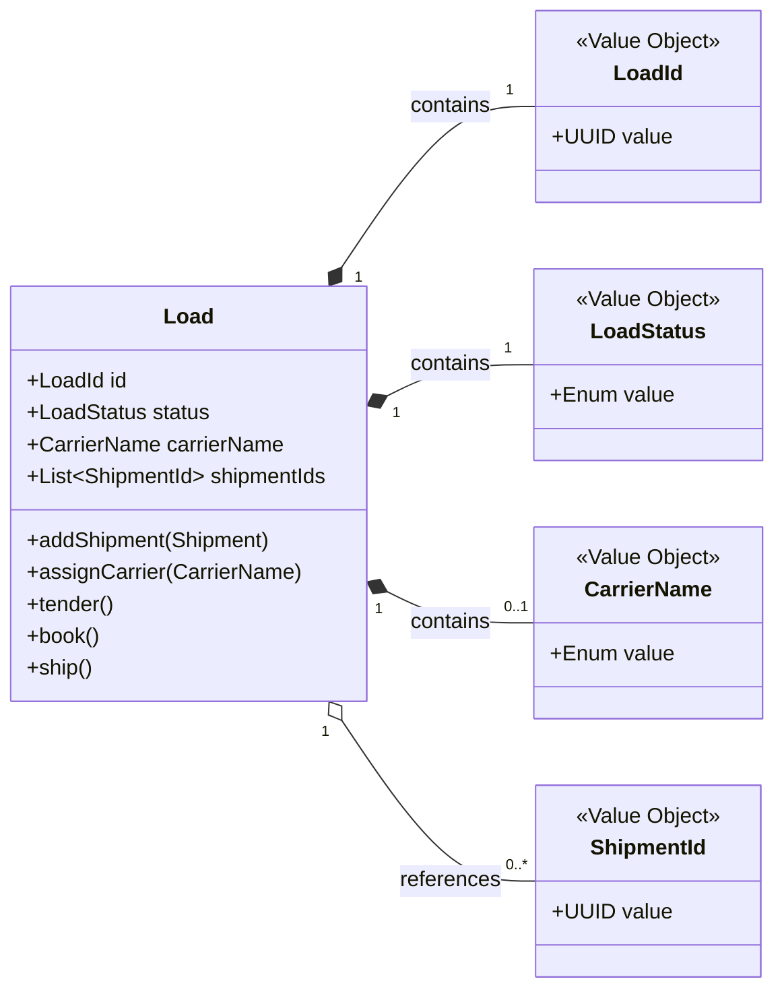

# Domain Aggregates

In our domain, an aggregate is a cluster of associated objects that we treat as a single unit for the purpose of data changes. Each aggregate has a root and a boundary. The root is the single, specific entity within the aggregate that is accessible from the outside. The boundary defines what is inside the aggregate. Nothing outside the boundary can hold a reference to anything inside, except to the root.

## 1. The `Shipment` Aggregate

The `Shipment` is a core aggregate in our domain. Its primary responsibility is to represent a single, trackable unit from its creation until it is assigned to a load.

### DDD Analysis

- **Aggregate Root:** `Shipment` is the root entity. All access to its internal state, such as the tracking history, must go through the `Shipment` object. This ensures its invariants (business rules) are always maintained.
- **Entity:** `TrackingEvent` is an entity *within* the `Shipment` aggregate. It has its own identity based on its properties (like timestamp and status), but it has no global identity outside of its parent `Shipment`. It cannot be queried for directly.
- **Value Objects:** The aggregate is composed of numerous value objects (`ShipmentId`, `OrderId`, `TrackingNumber`, `CarrierName`, `ShipmentStatus`). These objects are immutable and are defined by their attributes, not by an ID. They ensure that the data within our aggregate is always valid and meaningful.

### Class Diagram

---

## 2. The `Load` Aggregate

The `Load` aggregate represents a collection of shipments grouped for transport, such as a single truck. This is the central aggregate for our new transportation planning capabilities.

### DDD Analysis

- **Aggregate Root:** `Load` is the root, managing the state of the entire transportation unit.
- **Reference by Identity:** Crucially, the `Load` aggregate does **not** contain the full `Shipment` objects. Instead, it holds a list of `ShipmentId`s. This is a fundamental DDD pattern for modeling relationships between aggregates. It keeps the `Load` aggregate small and loosely coupled, preventing a single transaction from spanning multiple, potentially large, aggregates. If we need details of a shipment, we use its ID to fetch it from its own repository.
- **Consistency Boundary:** The `Load`'s invariants are focused on the load itself (e.g., you can't add a shipment to a `SHIPPED` load). It is not responsible for the internal consistency of each individual `Shipment`.

### Class Diagram

