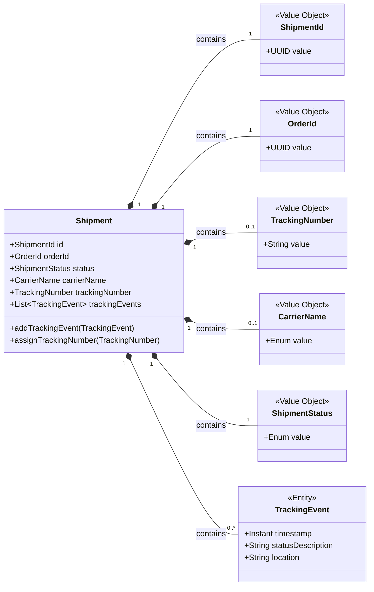
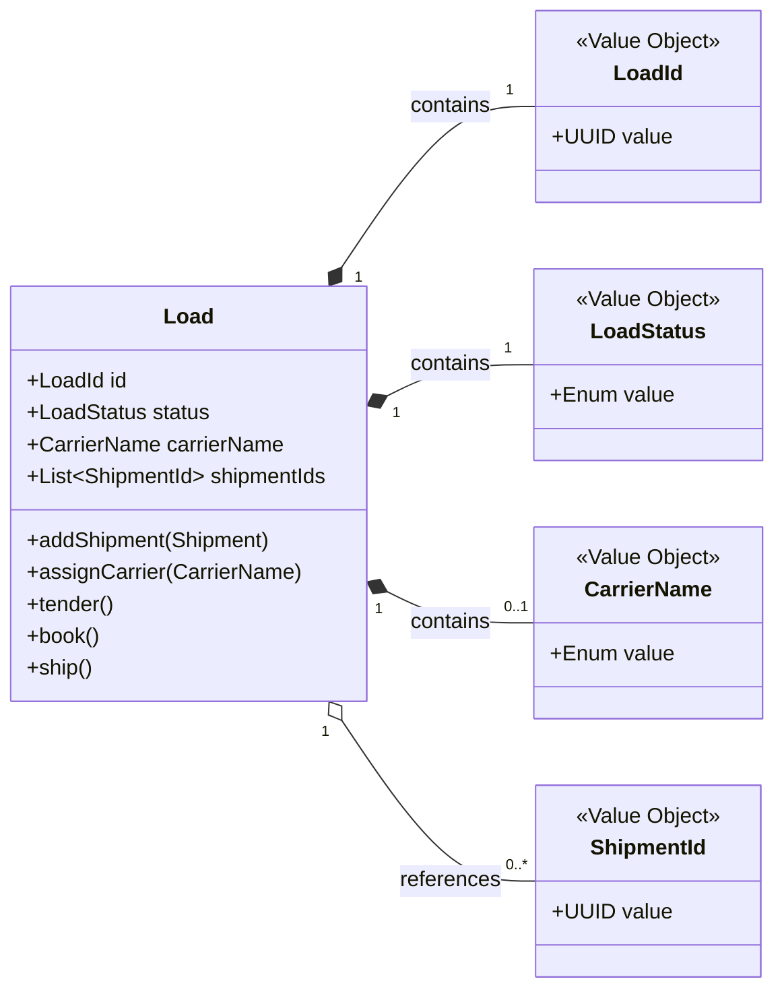

# Domain Aggregates

Aggregates define the transactional boundaries of the domain. Each aggregate exposes a single root, guards its invariants, and keeps references to other aggregates by identity so consistency stays local.

## Aggregate Map

- `Shipment` keeps the life cycle and tracking history for a single shipment, coordinating its own value objects and events.
- `Load` groups multiple shipments for transport, ensuring planning and tendering rules are respected without reaching across other aggregates.

## `Shipment` Aggregate

### Purpose

Represent one shipment from creation through assignment, capturing tracking history and current logistics status.

### Key Invariants

- All mutations flow through the `Shipment` root to keep the tracking history consistent.
- `TrackingEvent` instances exist only inside a `Shipment`; they cannot be referenced externally.
- Value objects such as `ShipmentId`, `OrderId`, `TrackingNumber`, `CarrierName`, and `ShipmentStatus` validate themselves before the aggregate changes state.

### Collaboration Notes

- Application services load the aggregate through its repository and invoke intent-revealing methods like `addTrackingEvent` or `assignTrackingNumber`.
- External systems observe the aggregate through domain events rather than holding direct references to child entities.

### Diagram

## `Load` Aggregate

### Purpose

Coordinate transportation for a set of shipments, driving planning, carrier assignment, and dispatch life cycle.

### Key Invariants

- Only the `Load` root can transition the load state (e.g., from `PLANNED` to `SHIPPED`).
- Shipments are referenced by `ShipmentId` to avoid coupling one consistency boundary to another.
- Operations such as `tender`, `book`, and `ship` enforce sequencing rules and carrier presence.

### Collaboration Notes

- Application services inject the load repository and the shipment repository, allowing validation that referenced shipments exist.
- Domain events emitted by the aggregate can trigger updates in other contexts (rates, documents) without breaking aggregate boundaries.

### Diagram

## Related Documents

- Return to the navigation hub via the [Docs Index](../README.md).
- Review how application services orchestrate these aggregates in [Application Services](./application-services.md).
- Dive into the supporting value objects in [Key Value Objects](./value-objects.md).
