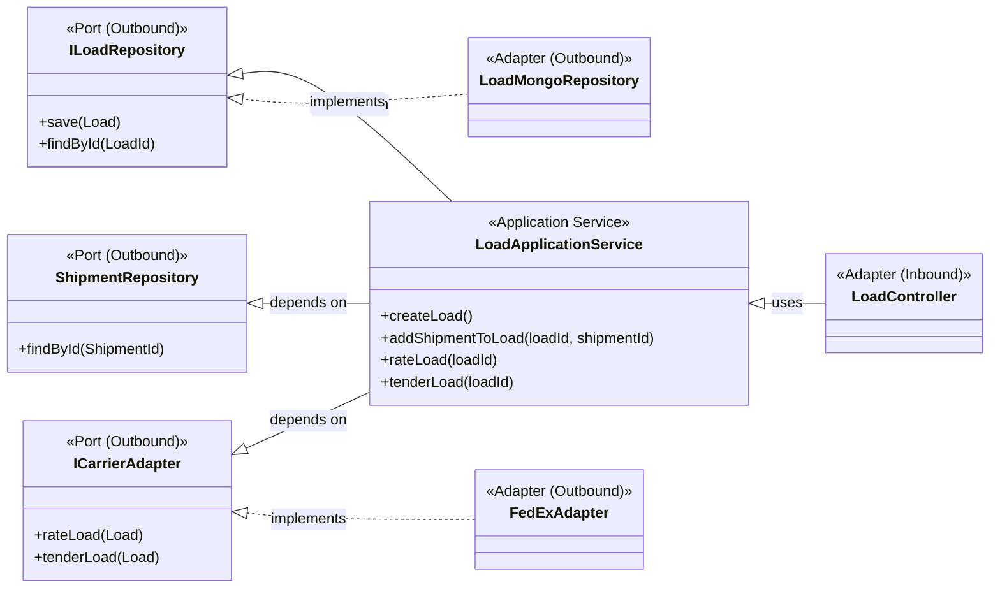

# Application Services & Hexagonal Architecture

The application services represent the use cases of our system. They form the core of our Hexagonal (or Ports and Adapters) Architecture. This layer acts as an intermediary between the outside world (e.g., web controllers, event consumers) and the rich business logic encapsulated within our domain model.

## Architectural Analysis

- **Orchestration, Not Logic:** Application services do not contain business logic themselves. Instead, they orchestrate the domain objects. A typical flow involves loading an aggregate from a repository, calling methods on that aggregate to perform a business action, and saving the result back to the repository.

- **Dependency Inversion:** The services depend on **interfaces** (ports), not on concrete implementations. For example, `LoadApplicationService` depends on the `ILoadRepository` interface, not on the `LoadMongoRepository` class. This decouples our application core from external technologies like MongoDB or a specific carrier's API, allowing us to swap them out with minimal impact.

- **Ports and Adapters:**
    - **Inbound Ports:** The application services themselves are the primary inbound port, exposing the application's capabilities to the outside world. They are called by adapters like REST controllers or Kafka consumers.
    - **Outbound Ports:** The repository and adapter interfaces (`ILoadRepository`, `ShipmentRepository`, `ICarrierAdapter`) are the outbound ports. They define the contracts for how the application communicates with external systems (the database, carrier APIs, etc.). The concrete implementations of these ports reside in the infrastructure layer.

## Class Diagram

This diagram illustrates the separation of concerns. The `LoadApplicationService` sits in the middle, depending only on abstractions (ports). The `LoadController` (an inbound adapter) calls the service, and the service uses the ports, which are implemented by outbound adapters like `LoadMongoRepository` and `FedExAdapter`.

