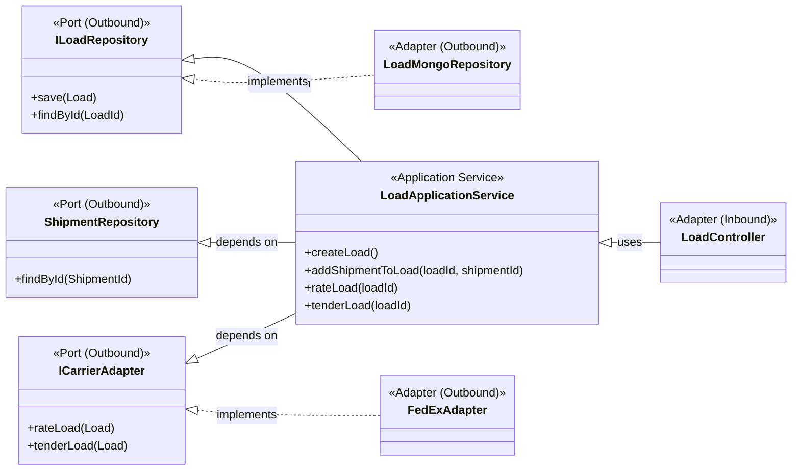

# Application Services

Application services implement use cases. They coordinate aggregates, enforce transactional rules, and keep the domain core safely behind ports defined by Hexagonal Architecture.

## Overview

- Expose operations that the outside world can invoke, such as creating loads or reacting to events.
- Delegate business rules to aggregates and value objects; services orchestrate rather than decide.
- Depend on interfaces only, supporting technology-neutral composition.

## Core Responsibilities

- **Use-case Orchestration:** Load aggregates from repositories, call domain methods, persist changes, and publish events.
- **Transactional Control:** Determine the scope of a unit of work while keeping domain logic inside aggregates.
- **Validation Gateway:** Perform cross-aggregate checks (existence, permissions) before invoking domain behaviour.

## Ports and Adapters

- **Inbound Ports:** Application services themselves form the inbound ports; adapters such as REST controllers or message consumers call them.
- **Outbound Ports:** Repository and integration interfaces (`ILoadRepository`, `ShipmentRepository`, `ICarrierAdapter`) abstract persistence and external systems.
- **Dependency Inversion:** Concrete adapters live in the infrastructure layer and implement the outbound ports, enabling swap-friendly technology choices.

## Collaboration Flow

1. A driving adapter (for example, `LoadController`) validates input and invokes the relevant application service method.
2. The service loads the required aggregate via its repository port and performs intent-driven operations on the aggregate.
3. After the aggregate enforces its invariants, the service saves it and coordinates further actions such as rating, tendering, or emitting domain events.

## Diagram

## Related Documents

- Return to the navigation hub via the [Docs Index](../README.md).
- Review the aggregate behaviour invoked here in [Domain Aggregates](./aggregates.md).
- See the adapter implementations that fulfill these ports in [Infrastructure Layer](./infrastructure-layer.md).
