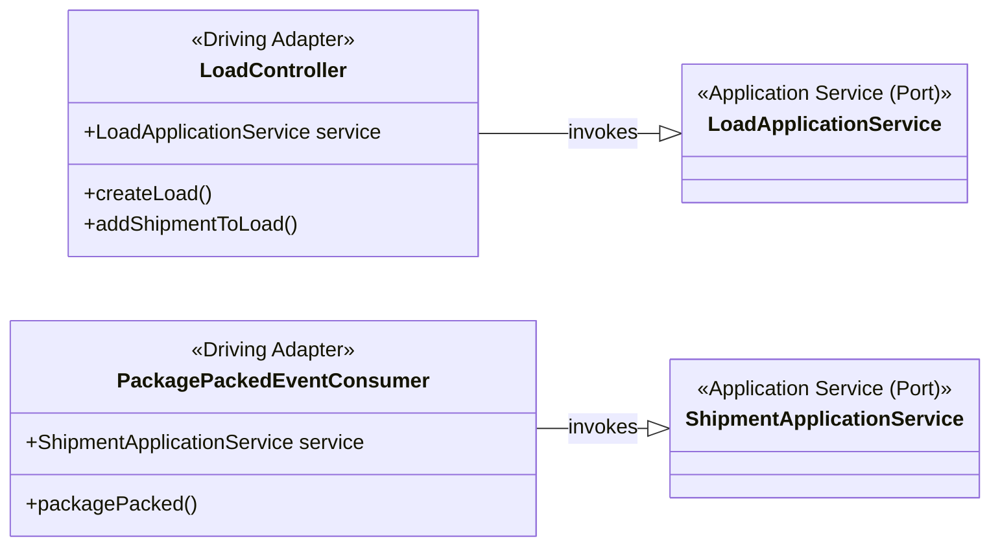
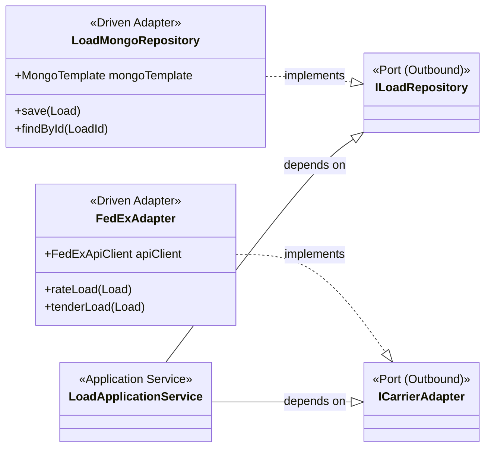

# Infrastructure Layer & Adapters

The infrastructure layer wires the abstract ports defined by the application core to concrete technologies. Adapters encapsulate integrations so the domain model stays pure while the system still interacts with databases, queues, and carrier APIs.

## Adapter Types

- **Driving (Inbound) Adapters:** Enter the system and call application services. Examples: HTTP controllers, message consumers, schedulers.
- **Driven (Outbound) Adapters:** Implement outbound ports so the application can persist data or collaborate with external systems.

## Driving Adapters

- Translate external protocols (REST payloads, Kafka events) into method calls on application services.
- Stay thin: perform mapping, validation, and error translation while leaving business decisions to the service layer.
- Remain replaceable: adding gRPC or CLI adapters reuses the same services without leaking transport concerns.

## Driven Adapters

- Implement outbound ports such as repositories and carrier connectors with technology-specific code.
- Isolate data-access and integration details; swapping MongoDB for PostgreSQL means adding a new adapter, not touching the domain.
- Encapsulate vendor APIs, handling authentication, mapping, and error translation in one place.

## Related Documents

- Return to the navigation hub via the [Docs Index](../README.md).
- See how services rely on these adapters in [Application Services](./application-services.md).
- Understand the aggregate invariants these adapters persist in [Domain Aggregates](./aggregates.md).
