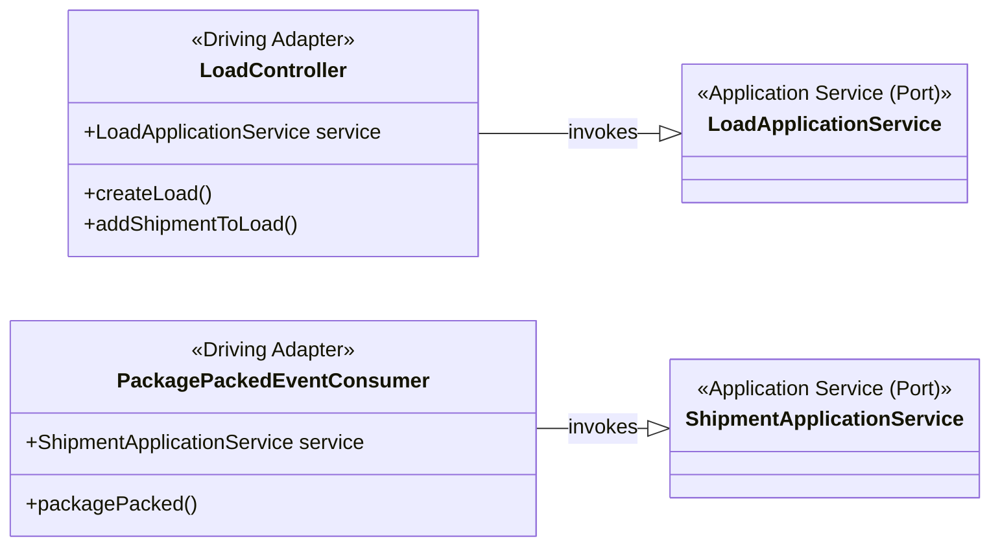
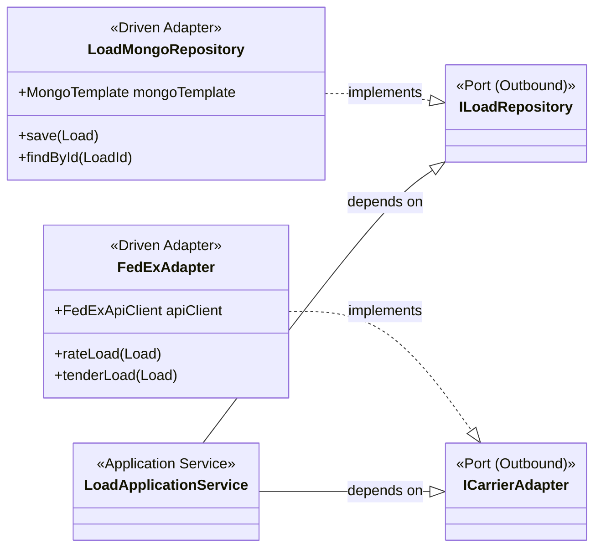

# The Infrastructure Layer & Adapters

The Infrastructure Layer is where the application's abstract ports are connected to concrete technologies. This layer contains the implementation details that are specific to external systems, such as databases, messaging brokers, and third-party APIs. In a Hexagonal Architecture, these implementations are called **Adapters**.

There are two types of adapters:

1.  **Driving (or Inbound) Adapters:** These adapters drive the application by calling the inbound ports (our application services). Examples include REST controllers and event consumers.
2.  **Driven (or Outbound) Adapters:** These adapters are driven by the application. They implement the outbound ports (interfaces) to connect to external systems like databases or carrier APIs.

---

## 1. Driving Adapters (Inbound)

These classes are the primary entry points into our application core. They translate external requests (HTTP, Kafka events) into method calls on our application services.

### Architectural Analysis

- **Thin Layer:** The adapters themselves contain minimal logic. Their main job is to map incoming data (e.g., an HTTP request body) into the DTOs or domain objects that the application service expects, and then invoke the service.
- **Decoupling:** The `LoadController` depends on `LoadApplicationService`, but the service has no knowledge of the controller or of HTTP. This allows us to easily add other inbound adapters (e.g., a gRPC endpoint) that can reuse the same application service.

### Class Diagram

---

## 2. Driven Adapters (Outbound)

These classes implement the outbound ports defined by the application core. They contain the specific logic needed to interact with external systems.

### Architectural Analysis

- **Implementation of Ports:** `LoadMongoRepository` is the concrete implementation of the `ILoadRepository` port. It contains the MongoDB-specific code (`MongoTemplate`, `Document` classes) needed to persist the `Load` aggregate.
- **Technology Isolation:** All MongoDB-related code is confined to this adapter. If we were to switch to a PostgreSQL database, we would only need to create a new `LoadSqlRepository` that implements the same `ILoadRepository` interface; the application core would remain completely unchanged.
- **External API Encapsulation:** The `FedExAdapter` encapsulates all the details of communicating with the FedEx API. It implements the generic `ICarrierAdapter` port, translating the application's requests into specific FedEx API calls and mapping the responses back to the domain objects.

### Class Diagram

