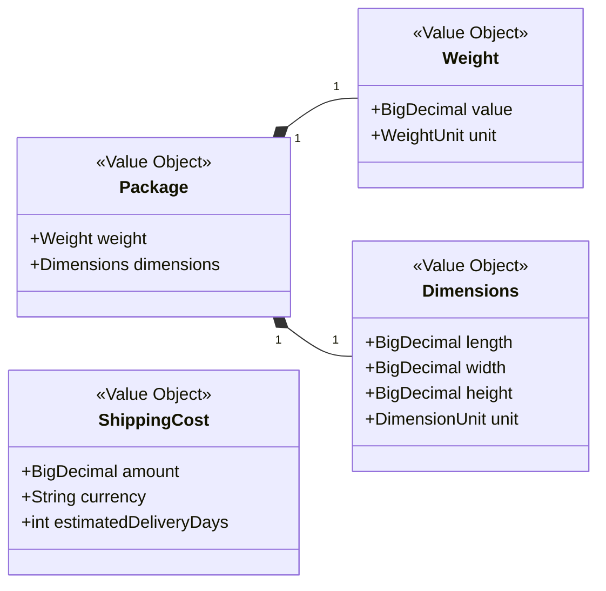

# Key Value Objects

Value Objects are a fundamental pattern in Domain-Driven Design. They are objects that we care about for *what they are*, not *who they are*. They have no conceptual identity and are defined by their attributes. Key characteristics include immutability, descriptive power, and self-validation.

## Analysis

- **Immutability:** Once created, a value object cannot be changed. If you need a different version, you create a new instance. This makes them thread-safe and predictable.
- **Self-Validation:** A value object is responsible for ensuring it is always in a valid state. For example, a `Weight` object cannot be created with a negative value. This pushes validation logic deep into the domain model.
- **Context and Meaning:** Instead of passing around primitive types like `String` or `double`, we use value objects to add context and meaning. A `TrackingNumber` is more expressive than a simple `String`.

## Class Diagram: Package & ShippingCost

This diagram shows two important value objects. `Package` is a composite value object that describes the physical properties of an item being shipped. `ShippingCost` represents the financial aspect of a shipment.

