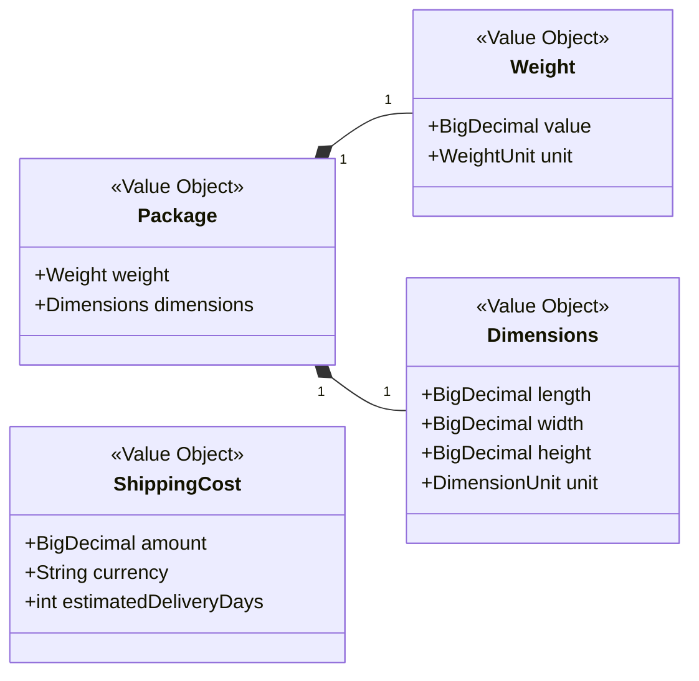

# Key Value Objects

Value objects capture domain concepts by describing what they are rather than who they are. They enrich the ubiquitous language, keep data valid, and avoid primitive obsession throughout the aggregates.

## Characteristics

- **Immutable:** Any change results in a new instance, which keeps calculations and multi-threaded flows predictable.
- **Self-validating:** Invariants such as positive weights or valid currencies live inside the value object, not scattered across services.
- **Contextual:** Types like `TrackingNumber` or `Weight` express meaning better than raw strings or numbers, helping the code read like the business language.

## Usage Guidelines

- Create value objects at the boundaries of the system (controllers, messaging) before invoking domain logic.
- Compose them inside aggregates to highlight invariants and avoid leaking primitive fields.
- Prefer small, focused behaviour on the value object itself (conversion, formatting) over utility helpers elsewhere.

## Example Diagram

The following composite shows how multiple value objects collaborate to describe a shipment parcel and its cost.

## Related Documents

- Return to the navigation hub via the [Docs Index](../README.md).
- See how these value objects shape aggregate state in [Domain Aggregates](./aggregates.md).
- Understand how application services construct and validate them in [Application Services](./application-services.md).
